# Capturing Flows

A recording shows what a screenshot cannot: the order things happened in.
Fast Browser records the browser session it drives to WebM and converts the
result to shareable GIFs with `fast-browser gif`.

Walk the graph; each box has its section below. A move the graph does not show
goes through its off-script gate.

## Which sessions record

Recording covers the session Fast Browser drives: the real Chrome tabs
attached through the extension relay, the ordinary connected setup. Only the
tabs Fast Browser controls are recorded. Other tabs, windows, and profiles
stay untouched, and the fast-browsing browser boundaries hold unchanged;
there is no separate isolated browser to record in. Because the recording is
of the user's real Chrome, everything visible in the driven tab lands in the
file, which is why the PII rule below matters in practice, not in theory.

## The capture graph

```dot
digraph capture_flow {
    rankdir=TB;

    "Trigger: motion is the evidence" [shape=ellipse];
    "Recording attempts >= 3?" [shape=diamond];
    "Recording on since before this session started?" [shape=diamond];
    "fast-browser configure --video 1280x720" [shape=plaintext];
    "configure result?" [shape=diamond];
    "Ask the human to restart the Fast Browser session" [shape=box];
    "Restart answer?" [shape=diamond];
    "browser_tabs {action: new, url: <where the flow starts>}" [shape=plaintext];
    "Drive exactly the one flow being shown" [shape=box];
    "Recorded flow result?" [shape=diamond];
    "STOP: never log in for the user" [shape=octagon style=filled fillcolor=red fontcolor=white];
    "STOP: never collect from an open tab" [shape=octagon style=filled fillcolor=red fontcolor=white];
    "Ask the human to log in in Chrome" [shape=box];
    "Login answer?" [shape=diamond];
    "browser_tabs {action: close}: the broken recording" [shape=plaintext];
    "browser_tabs {action: close}: the finished recording" [shape=plaintext];
    "ls -t ~/.fast-browser/output/videos/*.webm" [shape=plaintext];
    "Newest .webm is this flow's, complete?" [shape=diamond];
    "fast-browser gif <name>.webm --fps <8 first> --width <800 first>" [shape=plaintext];
    "gif result?" [shape=diamond];
    "Installed ffmpeg once already?" [shape=diamond];
    "brew install ffmpeg" [shape=plaintext];
    "fast-browser doctor" [shape=plaintext];
    "Bare name used already?" [shape=diamond];
    "Use the bare name inside the videos directory" [shape=box];
    "Watch the output GIF yourself" [shape=box];
    "What does the GIF show?" [shape=diamond];
    "Conversions >= 3?" [shape=diamond];
    "How to keep the PII out?" [shape=diamond];
    "STOP: never deliver motion evidence containing PII" [shape=octagon style=filled fillcolor=red fontcolor=white];
    "Capture annotated stills with annotating-screenshots" [shape=box];
    "Deliver the stills, saying why" [shape=box];
    "Deliver the GIF" [shape=box];

    "Off-script gate: recording attempts spent" [shape=box];
    "Make the approved move once: recording attempts spent" [shape=box];
    "Off-script rounds = 2: recording attempts spent?" [shape=diamond];
    "Off-script gate: configure refused the video setting" [shape=box];
    "Make the approved move once: configure refused" [shape=box];
    "Off-script rounds = 2: configure refused?" [shape=diamond];
    "Off-script gate: ffmpeg still missing" [shape=box];
    "Make the approved move once: ffmpeg still missing" [shape=box];
    "Off-script rounds = 2: ffmpeg still missing?" [shape=diamond];
    "Off-script gate: gif refuses the name" [shape=box];
    "Make the approved move once: gif refuses the name" [shape=box];
    "Off-script rounds = 2: gif refuses the name?" [shape=diamond];
    "Off-script gate: GIF still too heavy" [shape=box];
    "Make the approved move once: GIF still too heavy" [shape=box];
    "Off-script rounds = 2: GIF still too heavy?" [shape=diamond];

    "Held: nothing moved" [shape=doublecircle];
    "Handed back with what is done" [shape=doublecircle];
    "Stills delivered instead of motion" [shape=doublecircle];
    "GIF delivered" [shape=doublecircle style=filled fillcolor=lightgreen];

    "Trigger: motion is the evidence" -> "Recording attempts >= 3?";
    "Recording attempts >= 3?" -> "Recording on since before this session started?" [label="no"];
    "Recording attempts >= 3?" -> "Off-script gate: recording attempts spent" [label="yes: budget spent"];
    "Recording on since before this session started?" -> "browser_tabs {action: new, url: <where the flow starts>}" [label="yes"];
    "Recording on since before this session started?" -> "fast-browser configure --video 1280x720" [label="no, or unsure"];
    "fast-browser configure --video 1280x720" -> "configure result?";
    "configure result?" -> "Ask the human to restart the Fast Browser session" [label="set"];
    "configure result?" -> "Off-script gate: configure refused the video setting" [label="the command errored"];
    "Ask the human to restart the Fast Browser session" -> "Restart answer?";
    "Restart answer?" -> "browser_tabs {action: new, url: <where the flow starts>}" [label="restarted"];
    "Restart answer?" -> "Handed back with what is done" [label="will not restart"];

    "browser_tabs {action: new, url: <where the flow starts>}" -> "Drive exactly the one flow being shown";
    "Drive exactly the one flow being shown" -> "Recorded flow result?";
    "Recorded flow result?" -> "browser_tabs {action: close}: the finished recording" [label="done"];
    "Recorded flow result?" -> "browser_tabs {action: close}: the broken recording" [label="broke midway"];
    "Recorded flow result?" -> "Ask the human to log in in Chrome" [label="a login screen"];
    "Recorded flow result?" -> "STOP: never log in for the user" [label="tempted to log in yourself"];
    "Recorded flow result?" -> "STOP: never collect from an open tab" [label="tempted to collect from the open tab"];
    "STOP: never log in for the user" -> "Ask the human to log in in Chrome";
    "STOP: never collect from an open tab" -> "browser_tabs {action: close}: the finished recording";
    "Ask the human to log in in Chrome" -> "Login answer?";
    "Login answer?" -> "browser_tabs {action: close}: the broken recording" [label="signed in: re-record clean"];
    "Login answer?" -> "Handed back with what is done" [label="will not sign in"];
    "Login answer?" -> "STOP: never log in for the user" [label="tempted to type the password they pasted"];
    "browser_tabs {action: close}: the broken recording" -> "Recording attempts >= 3?";

    "browser_tabs {action: close}: the finished recording" -> "ls -t ~/.fast-browser/output/videos/*.webm";
    "ls -t ~/.fast-browser/output/videos/*.webm" -> "Newest .webm is this flow's, complete?";
    "Newest .webm is this flow's, complete?" -> "fast-browser gif <name>.webm --fps <8 first> --width <800 first>" [label="yes"];
    "Newest .webm is this flow's, complete?" -> "Recording attempts >= 3?" [label="none appeared, or tiny or unreadable"];

    "fast-browser gif <name>.webm --fps <8 first> --width <800 first>" -> "gif result?";
    "gif result?" -> "Watch the output GIF yourself" [label="ok"];
    "gif result?" -> "Installed ffmpeg once already?" [label="ffmpeg missing"];
    "gif result?" -> "Bare name used already?" [label="refused the name"];
    "Installed ffmpeg once already?" -> "brew install ffmpeg" [label="no"];
    "Installed ffmpeg once already?" -> "Off-script gate: ffmpeg still missing" [label="yes"];
    "brew install ffmpeg" -> "fast-browser doctor";
    "fast-browser doctor" -> "fast-browser gif <name>.webm --fps <8 first> --width <800 first>";
    "Bare name used already?" -> "Use the bare name inside the videos directory" [label="no"];
    "Bare name used already?" -> "Off-script gate: gif refuses the name" [label="yes"];
    "Use the bare name inside the videos directory" -> "fast-browser gif <name>.webm --fps <8 first> --width <800 first>";

    "Watch the output GIF yourself" -> "What does the GIF show?";
    "What does the GIF show?" -> "Deliver the GIF" [label="the whole flow, clean, sane size"];
    "What does the GIF show?" -> "Conversions >= 3?" [label="too heavy"];
    "What does the GIF show?" -> "Recording attempts >= 3?" [label="part of the flow missing"];
    "What does the GIF show?" -> "How to keep the PII out?" [label="PII in a frame"];
    "What does the GIF show?" -> "STOP: never deliver motion evidence containing PII" [label="tempted to deliver it anyway"];
    "STOP: never deliver motion evidence containing PII" -> "How to keep the PII out?";
    "Conversions >= 3?" -> "fast-browser gif <name>.webm --fps <8 first> --width <800 first>" [label="no: lower fps or width"];
    "Conversions >= 3?" -> "Off-script gate: GIF still too heavy" [label="yes"];
    "How to keep the PII out?" -> "Recording attempts >= 3?" [label="a cleaner re-record"];
    "How to keep the PII out?" -> "Capture annotated stills with annotating-screenshots" [label="annotated stills"];
    "Capture annotated stills with annotating-screenshots" -> "Deliver the stills, saying why";
    "Deliver the stills, saying why" -> "Stills delivered instead of motion";
    "Deliver the GIF" -> "GIF delivered";

    "Off-script gate: recording attempts spent" -> "Make the approved move once: recording attempts spent" [label="take: one more recording"];
    "Off-script gate: recording attempts spent" -> "Off-script rounds = 2: recording attempts spent?" [label="iterate: the human fixed the cause"];
    "Off-script gate: recording attempts spent" -> "Held: nothing moved" [label="hold"];
    "Off-script gate: recording attempts spent" -> "Handed back with what is done" [label="hand back"];
    "Make the approved move once: recording attempts spent" -> "browser_tabs {action: new, url: <where the flow starts>}";
    "Off-script rounds = 2: recording attempts spent?" -> "Recording on since before this session started?" [label="no: record again"];
    "Off-script rounds = 2: recording attempts spent?" -> "Handed back with what is done" [label="yes"];

    "Off-script gate: configure refused the video setting" -> "Make the approved move once: configure refused" [label="take: the human set it"];
    "Off-script gate: configure refused the video setting" -> "Off-script rounds = 2: configure refused?" [label="iterate: the human fixed the cause"];
    "Off-script gate: configure refused the video setting" -> "Held: nothing moved" [label="hold"];
    "Off-script gate: configure refused the video setting" -> "Handed back with what is done" [label="hand back"];
    "Make the approved move once: configure refused" -> "Ask the human to restart the Fast Browser session";
    "Off-script rounds = 2: configure refused?" -> "fast-browser configure --video 1280x720" [label="no: configure again"];
    "Off-script rounds = 2: configure refused?" -> "Handed back with what is done" [label="yes"];

    "Off-script gate: ffmpeg still missing" -> "Make the approved move once: ffmpeg still missing" [label="take: the human's install"];
    "Off-script gate: ffmpeg still missing" -> "Off-script rounds = 2: ffmpeg still missing?" [label="iterate: the human fixed the cause"];
    "Off-script gate: ffmpeg still missing" -> "Held: nothing moved" [label="hold"];
    "Off-script gate: ffmpeg still missing" -> "Handed back with what is done" [label="hand back"];
    "Make the approved move once: ffmpeg still missing" -> "fast-browser gif <name>.webm --fps <8 first> --width <800 first>";
    "Off-script rounds = 2: ffmpeg still missing?" -> "fast-browser doctor" [label="no: confirm, then convert"];
    "Off-script rounds = 2: ffmpeg still missing?" -> "Handed back with what is done" [label="yes"];

    "Off-script gate: gif refuses the name" -> "Make the approved move once: gif refuses the name" [label="take: the human's name"];
    "Off-script gate: gif refuses the name" -> "Off-script rounds = 2: gif refuses the name?" [label="iterate: the human fixed the cause"];
    "Off-script gate: gif refuses the name" -> "Held: nothing moved" [label="hold"];
    "Off-script gate: gif refuses the name" -> "Handed back with what is done" [label="hand back"];
    "Make the approved move once: gif refuses the name" -> "fast-browser gif <name>.webm --fps <8 first> --width <800 first>";
    "Off-script rounds = 2: gif refuses the name?" -> "Use the bare name inside the videos directory" [label="no: convert again"];
    "Off-script rounds = 2: gif refuses the name?" -> "Handed back with what is done" [label="yes"];

    "Off-script gate: GIF still too heavy" -> "Make the approved move once: GIF still too heavy" [label="take: the human accepts the size"];
    "Off-script gate: GIF still too heavy" -> "Off-script rounds = 2: GIF still too heavy?" [label="iterate: the human set new limits"];
    "Off-script gate: GIF still too heavy" -> "Held: nothing moved" [label="hold"];
    "Off-script gate: GIF still too heavy" -> "Handed back with what is done" [label="hand back"];
    "Make the approved move once: GIF still too heavy" -> "Deliver the GIF";
    "Off-script rounds = 2: GIF still too heavy?" -> "fast-browser gif <name>.webm --fps <8 first> --width <800 first>" [label="no: convert again"];
    "Off-script rounds = 2: GIF still too heavy?" -> "Handed back with what is done" [label="yes"];
}
```

### Ask the human to restart the Fast Browser session

The video setting is a runtime launch flag: only a runtime started after
`configure` records. A session already running when the setting changed
records nothing, however long it keeps going, so answer the graph's recording
question with "no, or unsure" whenever the setting's history is unknown.

`fast-browser configure --video 1280x720` sets the recorded frame size as
`<width>x<height>`, from 320x240 up to 3840x2160. `fast-browser configure
--video off` turns recording back off. Either form touches only the video
setting, never the profile, sessions, or palette.

Ask the human to restart the Fast Browser session and say when it is back; see
`## Asking the human`. A delegated subagent does not wait for the restart: it
puts the ask in its distilled result and returns, which is the hand back edge.

### Drive exactly the one flow being shown

Record one flow per tab. Every page records into its own file, so a recording
that mixes flows cannot be split afterwards. The fresh tab records from the
moment it opens: drive exactly the flow being demonstrated, from its first
step to its last, and stop.

The WebM is written incrementally and only becomes a valid, complete file
when the tab or the session closes cleanly; a session that dies without
closing its tab loses the recording. Close the finished recording's tab before
collecting anything from it. A take that broke midway is closed too, so it
finalizes and never passes for the newest complete recording.

Every path back through `Recording attempts >= 3?` re-drives the flow in a
fresh tab. When the flow mutates the real site, each re-record repeats that
effect: a checkout re-driven places another order. For a mutating flow, ask
for the human's go-ahead and clean test data at the result that sends the flow
back (broke midway, the login answer, no complete `.webm`, part of the flow
missing, a cleaner re-record), before `browser_tabs {action: new ...}` opens
the next tab, since that tab records from the moment it opens; see
`## Asking the human`.

- Go-ahead given: the flow goes back through `Recording attempts >= 3?` as the
  graph shows.
- Declined: close any broken recording tab so it finalizes, then end at
  `Handed back with what is done`. From the PII branch, choose annotated stills
  instead.

A delegated subagent does not wait for that answer: it puts the question in its
distilled result and returns, which is the hand back edge. Never re-drive a
mutating flow unasked, whatever the deadline.

### Ask the human to log in in Chrome

Never log in for the user and never type a credential. A password they paste
into the conversation is still never typed. Ask them to complete the login in
their real Chrome window, in a tab Fast Browser does not control, never the
recorded tab: that tab is still open and recording, so a login typed there
lands in its `.webm`. See `## Asking the human`. A delegated subagent does not
wait for the login: it puts the ask in its distilled result and returns, which
is the hand back edge.

Never resume in the recorded tab. After the human signs in, the broken
recording tab closes and the flow re-records clean in a fresh tab, which is
the `signed in: re-record clean` edge. The login screen already in that broken
recording is one more reason it is never delivered.

On `will not sign in`, close the broken recording tab before handing back, so
no recording tab is left open. Name any recording that holds the login screen
or the sign-in as withheld, by its path in `~/.fast-browser/output/videos/`.

### Use the bare name inside the videos directory

`<name>` is a name inside `~/.fast-browser/output/videos/`, never a path, and
`--out` is a bare name for the screenshots directory, never a path. Take the
name exactly as the newest-first listing printed it, without the directory,
and convert again once.

### Watch the output GIF yourself

Look at the GIF before anyone else sees it. Three things decide the edge: the
whole flow is visible, nothing sensitive is in any frame, and the file is a
sane size. When it is too heavy, convert again with a lower `--fps` or a
smaller `--width`. When a step of the flow is missing, the take is a
re-record. When any frame shows PII, go to `## PII in motion`.

### Capture annotated stills with annotating-screenshots

The recording tab is closed, so the stills need the pages again: reach each
key step of the flow and capture it with the annotating-screenshots skill,
blurring what needs blurring there. For a flow that mutates, stop short of the
mutating step unless the human gave the go-ahead (see
`### Drive exactly the one flow being shown`), and
say which step the stills leave out.

### Deliver the stills, saying why

Say plainly that the stills replace the recording because it showed PII, and
name the withheld artifacts by their paths: the GIF in
`~/.fast-browser/screenshots/` and the `.webm` in
`~/.fast-browser/output/videos/`. The human is left in no doubt which file was
not delivered and where it still sits.

### Deliver the GIF

Hand over the GIF from `~/.fast-browser/screenshots/`. That directory is
destroyed by `fast-browser uninstall --purge-data`, so deliver the file rather
than leave it there. If an earlier take showed PII, say it was withheld and
name its path.

## PII in motion

A video cannot carry `annotate`'s redactions: there is no blur pass over a
recording, so anything visible in any frame ships exactly as it appeared.
When the flow you recorded shows PII, do not deliver the recording. Either
re-record a cleaner flow that keeps the PII out of frame (test data, a
narrower window, a different case), or fall back to annotated stills.

`a cleaner re-record` is a re-record like any other, so a flow that mutates
the real site first needs the go-ahead in
`### Drive exactly the one flow being shown`; without it, choose annotated
stills.

Say plainly which you did, and name the recording that was not delivered.
Never deliver motion evidence containing PII on the promise that nobody will
look closely.

## The gif command

| Flag | Rule |
|---|---|
| `<name>.webm` | a bare name inside `~/.fast-browser/output/videos/`, never a path |
| `--fps` | 1 to 30, default 8 |
| `--width` | caps the output width at up to 1200 px, default 1200, never upscales; start at 800 |
| `--out` | a bare name for the GIF; otherwise the video's name with `.gif` |

Recordings land in `~/.fast-browser/output/videos/` under generated names; the
newest `.webm` there is the recording that just finished. The GIF lands in
`~/.fast-browser/screenshots/`. Conversion needs ffmpeg.

## Off-script gates

Each gate quotes its evidence and offers four answers:

- **take**: the human names a move. `Make the approved move once: <origin>`
  means make exactly the move the human named, once. When the human made the
  move themselves, it means confirm once that their move took effect instead.
  Either way, then follow the edge out of that box.
- **iterate**: the human fixed the cause. Pass the gate's `Off-script rounds =
  2: <origin>?` counter, then retry the refused step. That step's own counter is
  not reset, so a second refusal returns to the gate.
- **hold**: end with nothing further moved.
- **hand back**: report what is done and stop.

Option descriptions are written as the human reads them. A delegated subagent
does not wait at a gate: it puts the quote and the four options in its
distilled result and returns, which is the hand back edge (see
`## Asking the human`).

### Off-script gate: recording attempts spent

Quote what ended each take (broke midway, a login screen, no complete `.webm`, part of the flow missing, PII).
- **You fix the cause** (iterate, recommended): you clear what keeps breaking the takes, and I record again from the recording check.
- **One more recording** (take): I record the flow once more in a fresh tab, as you direct.
- **Hold, nothing moved** (hold): I stop here and change nothing further.
- **Hand back what is done** (hand back): I report the takes and why each failed.

### Off-script gate: configure refused the video setting

Quote the `configure` command and its error.
- **You fix the cause** (iterate, recommended): you clear what made `configure` refuse, and I run it once more.
- **You set it yourself** (take): you turn recording on your own way, and I ask for the restart, whose first recording confirms it.
- **Hold, nothing moved** (hold): I stop here and change nothing further.
- **Hand back what is done** (hand back): I report that recording could not be turned on.

### Off-script gate: ffmpeg still missing

Quote the `gif` error that reports the renderer missing after `brew install ffmpeg` already ran.
- **You install ffmpeg yourself** (take, recommended): you install it your own way, and I convert once to confirm it works.
- **You fix the cause** (iterate): you repair the install or its path, and I run `fast-browser doctor`, then convert.
- **Hold, nothing moved** (hold): I stop here and change nothing further.
- **Hand back what is done** (hand back): I report the finished `.webm` by name and the missing renderer.

### Off-script gate: gif refuses the name

Quote the `gif` command and its refusal after the bare name was already tried.
- **Give me the name** (take, recommended): you name the video to convert, and I convert it once.
- **You fix the cause** (iterate): you clear what makes the name refused, and I convert the bare name again.
- **Hold, nothing moved** (hold): I stop here and change nothing further.
- **Hand back what is done** (hand back): I report the finished `.webm` by name and the refusal.

### Off-script gate: GIF still too heavy

Quote the GIF's size and the `--fps` and `--width` each conversion used.
- **Deliver it at this size** (take, recommended): you accept the size, and I deliver the GIF as it is.
- **Set new limits** (iterate): you name the fps, width or size to aim for, and I convert again.
- **Hold, nothing moved** (hold): I stop here and change nothing further.
- **Hand back what is done** (hand back): I report the GIF's path and size without delivering it.

## Asking the human

In a main session, ask with the host's question tool (or a plain message) and
end the turn. As a delegated subagent, which has no user, put the question in
the distilled result and return, leaving the tab where it is: that is the hand
back edge. Your caller relays the question and may resume you with the answer;
when it does, carry on from the step you stopped at.

## When something fails

| Symptom | Cause, and the graph edge that handles it |
|---|---|
| No `.webm` appears in `~/.fast-browser/output/videos/` | Recording was enabled after the session started, and the setting only applies to sessions started after it. `none appeared` leads back through the recording check to `configure` and the restart |
| The `.webm` is tiny or unreadable | The tab or session was still open, so the file was not finalized. Close first; `tiny or unreadable` leads to a fresh take |
| `gif` reports the renderer missing | `ffmpeg missing` leads to `brew install ffmpeg`, then `fast-browser doctor` to confirm; a second miss opens its gate |
| `gif` refuses the name | `refused the name` leads to the bare name inside the videos directory; a second refusal opens its gate |

## Rationalizations

| Thought | Reality |
|---|---|
| "The tab is still recording, so the login doesn't cost us the flow." | The login lands in the recording. Never resume in the recorded tab: close it and re-record clean in a fresh tab. |
| "Closing the tab would finalize the recording before the flow is captured." | That take is already broken. Finalizing it is the point; the clean take starts in a fresh tab. |
| "They pasted the password and said keep recording." | STOP: never log in for the user. Ask them to sign in in Chrome. |
| "The deadline is close; I'll collect the `.webm` and close the tab after." | STOP: never collect from an open tab. The file is only complete once the tab closes. |
| "The PII is in two frames; nobody will look closely." | STOP: never deliver motion evidence containing PII. Re-record cleanly or deliver annotated stills. |
| "A straight re-drive is the faster of the two options under the deadline." | Re-driving a mutating flow repeats its effect, such as another real order. It needs the human's go-ahead and clean test data; otherwise annotated stills. |
| "Re-driving is not finishable in time, so the stills can come from memory." | Stills need the pages. Reach each key step again, stopping short of a mutating one. |
| "Recording is turned on, so this session records." | Only a runtime started after `configure` records. Ask for the restart. |
