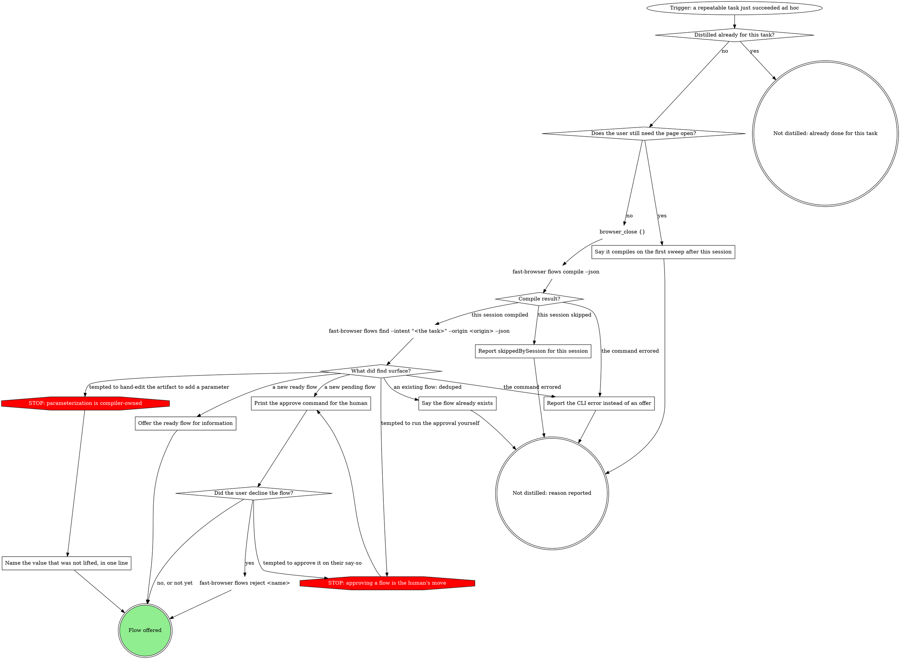

# Fast Browsing

Minimize browser round trips and observation size. Prefer one informed batch
over repeated inspect-and-click cycles.

Walk the graph; each box has its section below. A move the graph does not show
goes through its off-script gate.

## The task graph

```dot
digraph fast_browsing {
    rankdir=TB;

    "Trigger: a browser task to drive" [shape=ellipse];
    "fast-browser flows find --intent \"<task>\" --origin <origin> --json" [shape=plaintext];
    "Runnable candidate?" [shape=diamond];
    "STOP: never run a candidate with runnable: false" [shape=octagon style=filled fillcolor=red fontcolor=white];
    "Tell the human what unblocks the flow" [shape=box];
    "browser_run_code_unsafe {filename, args}: the candidate's invocation verbatim" [shape=plaintext];
    "Flow result?" [shape=diamond];
    "STOP: a failed flow is never retried or hand-edited" [shape=octagon style=filled fillcolor=red fontcolor=white];
    "A completed flow step mutated?" [shape=diamond];
    "STOP: never repeat the call SIDECAR_LOST failed" [shape=octagon style=filled fillcolor=red fontcolor=white];
    "Read stepsCompleted and recovery from the SIDECAR_LOST payload" [shape=box];
    "What does recovery say?" [shape=diamond];
    "Verify the mutating step's effect on the site" [shape=box];
    "Did the mutating step land?" [shape=diamond];
    "Restarted once after SIDECAR_LOST?" [shape=diamond];
    "browser_run_code_unsafe {filename, args}: the same invocation, restarted" [shape=plaintext];
    "Report SIDECAR_LOST and stop" [shape=box];

    "Read {file_path: ~/.fast-browser/macros/MACROS.md}" [shape=plaintext];
    "A MACROS.md entry matches the task?" [shape=diamond];
    "STOP: a macro runs by filename and args only" [shape=octagon style=filled fillcolor=red fontcolor=white];
    "browser_run_code_unsafe {filename, args}: the MACROS.md entry" [shape=plaintext];
    "Macro result?" [shape=diamond];
    "Macro attempts = 2?" [shape=diamond];
    "Record the macro failure as browser-macros directs" [shape=box];

    "Known origin, page not yet scouted?" [shape=diamond];
    "fast-browser sites affordances --url <url> --json" [shape=plaintext];
    "Site record?" [shape=diamond];
    "Apply what the site record knows" [shape=box];
    "Repeatable journey with no matching flow?" [shape=diamond];
    "STOP: explore by scouting, then batching" [shape=octagon style=filled fillcolor=red fontcolor=white];
    "Drive the journey with discrete tool calls" [shape=box];
    "Journey result?" [shape=diamond];
    "Journey failures = 4?" [shape=diamond];
    "Same call failed twice?" [shape=diamond];
    "Scout the page cheaply" [shape=box];
    "Scout found what the batch needs?" [shape=diamond];
    "STOP: no full-page snapshot while a scoped read will do" [shape=octagon style=filled fillcolor=red fontcolor=white];
    "browser_snapshot {target, depth}: the one region" [shape=plaintext];
    "browser_run_code_unsafe {code}: the batched remainder" [shape=plaintext];
    "Batch result?" [shape=diamond];
    "Same scripted step failed twice?" [shape=diamond];
    "Do the failing step with one single-step tool" [shape=box];
    "Batch rounds = 6?" [shape=diamond];
    "Read narrowly for the next batch" [shape=box];

    "Login screens this task = 2?" [shape=diamond];
    "Secrets file and operator-named secrets for this site?" [shape=diamond];
    "STOP: never log in for the user or type a credential" [shape=octagon style=filled fillcolor=red fontcolor=white];
    "STOP: never guess a secret name; ask for it" [shape=octagon style=filled fillcolor=red fontcolor=white];
    "Ask the human to log in in Chrome" [shape=box];
    "Login answer?" [shape=diamond];
    "browser_navigate {url: <login url>}" [shape=plaintext];
    "browser_fill_form {fields: secret NAMES as values}" [shape=plaintext];
    "browser_click {target: <submit>}" [shape=plaintext];
    "browser_find {text: <what only a signed-in page shows>}" [shape=plaintext];
    "Signed-in marker found?" [shape=diamond];

    "Did the task use 3+ discrete calls with no flow or macro?" [shape=diamond];
    "Distill the session after an ad hoc solve" [shape=box];
    "Return the distilled result" [shape=box];

    "Off-script gate: a flow step mutated before FLOW_RUNNER_FAILURE" [shape=box];
    "Make the approved move once: a flow step mutated" [shape=box];
    "Off-script rounds = 2: a flow step mutated?" [shape=diamond];
    "Off-script gate: a mutating step landed before SIDECAR_LOST" [shape=box];
    "Make the approved move once: a mutating step landed" [shape=box];
    "Off-script rounds = 2: a mutating step landed?" [shape=diamond];
    "Off-script gate: the discrete journey keeps failing" [shape=box];
    "Make the approved move once: the journey keeps failing" [shape=box];
    "Off-script rounds = 2: the journey keeps failing?" [shape=diamond];
    "Off-script gate: a discrete call failed twice" [shape=box];
    "Make the approved move once: a call failed twice" [shape=box];
    "Off-script rounds = 2: a call failed twice?" [shape=diamond];
    "Off-script gate: batch rounds spent" [shape=box];
    "Make the approved move once: batch rounds spent" [shape=box];
    "Off-script rounds = 2: batch rounds spent?" [shape=diamond];
    "Off-script gate: the secrets login failed" [shape=box];
    "Make the approved move once: the secrets login failed" [shape=box];
    "Off-script rounds = 2: the secrets login failed?" [shape=diamond];

    "Stopped: SIDECAR_LOST reported" [shape=doublecircle];
    "Held: nothing moved" [shape=doublecircle];
    "Handed back with what is done" [shape=doublecircle];
    "Task done: distilled result returned" [shape=doublecircle style=filled fillcolor=lightgreen];

    "Trigger: a browser task to drive" -> "fast-browser flows find --intent \"<task>\" --origin <origin> --json";
    "fast-browser flows find --intent \"<task>\" --origin <origin> --json" -> "Runnable candidate?";
    "Runnable candidate?" -> "browser_run_code_unsafe {filename, args}: the candidate's invocation verbatim" [label="yes"];
    "Runnable candidate?" -> "Tell the human what unblocks the flow" [label="only runnable: false ones"];
    "Runnable candidate?" -> "Read {file_path: ~/.fast-browser/macros/MACROS.md}" [label="none, or the command errored"];
    "Runnable candidate?" -> "STOP: never run a candidate with runnable: false" [label="tempted to run a runnable: false candidate"];
    "STOP: never run a candidate with runnable: false" -> "Tell the human what unblocks the flow";
    "Tell the human what unblocks the flow" -> "Read {file_path: ~/.fast-browser/macros/MACROS.md}";

    "browser_run_code_unsafe {filename, args}: the candidate's invocation verbatim" -> "Flow result?";
    "Flow result?" -> "Did the task use 3+ discrete calls with no flow or macro?" [label="ok"];
    "Flow result?" -> "A completed flow step mutated?" [label="FLOW_RUNNER_FAILURE"];
    "Flow result?" -> "Read stepsCompleted and recovery from the SIDECAR_LOST payload" [label="SIDECAR_LOST"];
    "Flow result?" -> "STOP: a failed flow is never retried or hand-edited" [label="tempted to retry the flow or hand-edit its artifact"];
    "Flow result?" -> "STOP: never repeat the call SIDECAR_LOST failed" [label="tempted to repeat the call SIDECAR_LOST failed"];
    "STOP: a failed flow is never retried or hand-edited" -> "A completed flow step mutated?";
    "STOP: never repeat the call SIDECAR_LOST failed" -> "Read stepsCompleted and recovery from the SIDECAR_LOST payload";
    "A completed flow step mutated?" -> "Read {file_path: ~/.fast-browser/macros/MACROS.md}" [label="no"];
    "A completed flow step mutated?" -> "Off-script gate: a flow step mutated before FLOW_RUNNER_FAILURE" [label="yes: redoing the task would repeat it"];

    "Read stepsCompleted and recovery from the SIDECAR_LOST payload" -> "What does recovery say?";
    "What does recovery say?" -> "Restarted once after SIDECAR_LOST?" [label="restart the flow from navigation"];
    "What does recovery say?" -> "Verify the mutating step's effect on the site" [label="verify first: a completed step mutated"];
    "Verify the mutating step's effect on the site" -> "Did the mutating step land?";
    "Did the mutating step land?" -> "Off-script gate: a mutating step landed before SIDECAR_LOST" [label="it landed: a restart would repeat it"];
    "Did the mutating step land?" -> "Restarted once after SIDECAR_LOST?" [label="nothing landed"];
    "Did the mutating step land?" -> "Report SIDECAR_LOST and stop" [label="unsure"];
    "Restarted once after SIDECAR_LOST?" -> "browser_run_code_unsafe {filename, args}: the same invocation, restarted" [label="no"];
    "Restarted once after SIDECAR_LOST?" -> "Report SIDECAR_LOST and stop" [label="yes: a second SIDECAR_LOST"];
    "browser_run_code_unsafe {filename, args}: the same invocation, restarted" -> "Flow result?";
    "Report SIDECAR_LOST and stop" -> "Stopped: SIDECAR_LOST reported";

    "Read {file_path: ~/.fast-browser/macros/MACROS.md}" -> "A MACROS.md entry matches the task?";
    "A MACROS.md entry matches the task?" -> "browser_run_code_unsafe {filename, args}: the MACROS.md entry" [label="yes"];
    "A MACROS.md entry matches the task?" -> "Known origin, page not yet scouted?" [label="no"];
    "A MACROS.md entry matches the task?" -> "STOP: a macro runs by filename and args only" [label="tempted to open the macro script or send inline code"];
    "STOP: a macro runs by filename and args only" -> "browser_run_code_unsafe {filename, args}: the MACROS.md entry";
    "browser_run_code_unsafe {filename, args}: the MACROS.md entry" -> "Macro result?";
    "Macro result?" -> "Did the task use 3+ discrete calls with no flow or macro?" [label="ok"];
    "Macro result?" -> "Login screens this task = 2?" [label="a login screen"];
    "Macro result?" -> "Macro attempts = 2?" [label="failed"];
    "Macro attempts = 2?" -> "browser_run_code_unsafe {filename, args}: the MACROS.md entry" [label="no: run it once more"];
    "Macro attempts = 2?" -> "Record the macro failure as browser-macros directs" [label="yes"];
    "Record the macro failure as browser-macros directs" -> "Known origin, page not yet scouted?";

    "Known origin, page not yet scouted?" -> "fast-browser sites affordances --url <url> --json" [label="yes"];
    "Known origin, page not yet scouted?" -> "Repeatable journey with no matching flow?" [label="no"];
    "fast-browser sites affordances --url <url> --json" -> "Site record?";
    "Site record?" -> "Apply what the site record knows" [label="found, or inventory non-empty"];
    "Site record?" -> "Repeatable journey with no matching flow?" [label="unknown origin, or the command errored"];
    "Apply what the site record knows" -> "Repeatable journey with no matching flow?";

    "Repeatable journey with no matching flow?" -> "Drive the journey with discrete tool calls" [label="yes"];
    "Repeatable journey with no matching flow?" -> "Scout the page cheaply" [label="no: exploration or a one-off"];
    "Repeatable journey with no matching flow?" -> "STOP: explore by scouting, then batching" [label="tempted to explore one call per click"];
    "STOP: explore by scouting, then batching" -> "Scout the page cheaply";

    "Drive the journey with discrete tool calls" -> "Journey result?";
    "Journey result?" -> "Did the task use 3+ discrete calls with no flow or macro?" [label="done"];
    "Journey result?" -> "Login screens this task = 2?" [label="a login screen"];
    "Journey result?" -> "Journey failures = 4?" [label="a call failed"];
    "Journey failures = 4?" -> "Same call failed twice?" [label="no"];
    "Journey failures = 4?" -> "Off-script gate: the discrete journey keeps failing" [label="yes: budget spent"];
    "Same call failed twice?" -> "Drive the journey with discrete tool calls" [label="no: try it once more"];
    "Same call failed twice?" -> "Off-script gate: a discrete call failed twice" [label="yes"];

    "Scout the page cheaply" -> "Scout found what the batch needs?";
    "Scout found what the batch needs?" -> "browser_run_code_unsafe {code}: the batched remainder" [label="yes"];
    "Scout found what the batch needs?" -> "browser_snapshot {target, depth}: the one region" [label="no: page-affordances skipped it"];
    "Scout found what the batch needs?" -> "STOP: no full-page snapshot while a scoped read will do" [label="tempted to take a full-page snapshot"];
    "STOP: no full-page snapshot while a scoped read will do" -> "browser_snapshot {target, depth}: the one region";
    "browser_snapshot {target, depth}: the one region" -> "browser_run_code_unsafe {code}: the batched remainder";
    "browser_run_code_unsafe {code}: the batched remainder" -> "Batch result?";
    "Batch result?" -> "Did the task use 3+ discrete calls with no flow or macro?" [label="done"];
    "Batch result?" -> "Login screens this task = 2?" [label="a login screen"];
    "Batch result?" -> "Batch rounds = 6?" [label="the next step needs what the page shows"];
    "Batch result?" -> "Same scripted step failed twice?" [label="a step failed"];
    "Same scripted step failed twice?" -> "Batch rounds = 6?" [label="no"];
    "Same scripted step failed twice?" -> "Do the failing step with one single-step tool" [label="yes"];
    "Do the failing step with one single-step tool" -> "Batch rounds = 6?";
    "Batch rounds = 6?" -> "Read narrowly for the next batch" [label="no"];
    "Batch rounds = 6?" -> "Off-script gate: batch rounds spent" [label="yes: budget spent"];
    "Read narrowly for the next batch" -> "browser_run_code_unsafe {code}: the batched remainder";

    "Login screens this task = 2?" -> "Secrets file and operator-named secrets for this site?" [label="no"];
    "Login screens this task = 2?" -> "Handed back with what is done" [label="yes: budget spent"];
    "Secrets file and operator-named secrets for this site?" -> "Ask the human to log in in Chrome" [label="no: a local install, or no names given"];
    "Secrets file and operator-named secrets for this site?" -> "browser_navigate {url: <login url>}" [label="yes"];
    "Secrets file and operator-named secrets for this site?" -> "STOP: never log in for the user or type a credential" [label="tempted to log in yourself or type a credential value"];
    "Secrets file and operator-named secrets for this site?" -> "STOP: never guess a secret name; ask for it" [label="tempted to guess a secret name"];
    "STOP: never log in for the user or type a credential" -> "Ask the human to log in in Chrome";
    "STOP: never guess a secret name; ask for it" -> "Ask the human to log in in Chrome";
    "Ask the human to log in in Chrome" -> "Login answer?";
    "Login answer?" -> "Known origin, page not yet scouted?" [label="signed in"];
    "Login answer?" -> "Secrets file and operator-named secrets for this site?" [label="the operator named the secrets"];
    "Login answer?" -> "Handed back with what is done" [label="will not sign in"];
    "Login answer?" -> "STOP: never log in for the user or type a credential" [label="tempted to type the password they pasted"];
    "browser_navigate {url: <login url>}" -> "browser_fill_form {fields: secret NAMES as values}";
    "browser_fill_form {fields: secret NAMES as values}" -> "browser_click {target: <submit>}";
    "browser_click {target: <submit>}" -> "browser_find {text: <what only a signed-in page shows>}";
    "browser_find {text: <what only a signed-in page shows>}" -> "Signed-in marker found?";
    "Signed-in marker found?" -> "Known origin, page not yet scouted?" [label="yes"];
    "Signed-in marker found?" -> "Off-script gate: the secrets login failed" [label="no: never retry, lockout risk"];

    "Did the task use 3+ discrete calls with no flow or macro?" -> "Distill the session after an ad hoc solve" [label="yes"];
    "Did the task use 3+ discrete calls with no flow or macro?" -> "Return the distilled result" [label="no"];
    "Distill the session after an ad hoc solve" -> "Return the distilled result";
    "Return the distilled result" -> "Task done: distilled result returned";

    "Off-script gate: a flow step mutated before FLOW_RUNNER_FAILURE" -> "Make the approved move once: a flow step mutated" [label="take: finish the rest by hand"];
    "Off-script gate: a flow step mutated before FLOW_RUNNER_FAILURE" -> "Off-script rounds = 2: a flow step mutated?" [label="iterate: the human undid the effect"];
    "Off-script gate: a flow step mutated before FLOW_RUNNER_FAILURE" -> "Held: nothing moved" [label="hold"];
    "Off-script gate: a flow step mutated before FLOW_RUNNER_FAILURE" -> "Handed back with what is done" [label="hand back"];
    "Make the approved move once: a flow step mutated" -> "Known origin, page not yet scouted?";
    "Off-script rounds = 2: a flow step mutated?" -> "Read {file_path: ~/.fast-browser/macros/MACROS.md}" [label="no: redo the task"];
    "Off-script rounds = 2: a flow step mutated?" -> "Handed back with what is done" [label="yes"];

    "Off-script gate: a mutating step landed before SIDECAR_LOST" -> "Make the approved move once: a mutating step landed" [label="take: finish the rest by hand"];
    "Off-script gate: a mutating step landed before SIDECAR_LOST" -> "Off-script rounds = 2: a mutating step landed?" [label="iterate: the human undid the effect"];
    "Off-script gate: a mutating step landed before SIDECAR_LOST" -> "Held: nothing moved" [label="hold"];
    "Off-script gate: a mutating step landed before SIDECAR_LOST" -> "Handed back with what is done" [label="hand back"];
    "Make the approved move once: a mutating step landed" -> "Known origin, page not yet scouted?";
    "Off-script rounds = 2: a mutating step landed?" -> "Restarted once after SIDECAR_LOST?" [label="no: restart"];
    "Off-script rounds = 2: a mutating step landed?" -> "Handed back with what is done" [label="yes"];

    "Off-script gate: the discrete journey keeps failing" -> "Make the approved move once: the journey keeps failing" [label="take: the human's move"];
    "Off-script gate: the discrete journey keeps failing" -> "Off-script rounds = 2: the journey keeps failing?" [label="iterate: the human fixed the cause"];
    "Off-script gate: the discrete journey keeps failing" -> "Held: nothing moved" [label="hold"];
    "Off-script gate: the discrete journey keeps failing" -> "Handed back with what is done" [label="hand back"];
    "Make the approved move once: the journey keeps failing" -> "Journey result?";
    "Off-script rounds = 2: the journey keeps failing?" -> "Drive the journey with discrete tool calls" [label="no: resume"];
    "Off-script rounds = 2: the journey keeps failing?" -> "Handed back with what is done" [label="yes"];

    "Off-script gate: a discrete call failed twice" -> "Make the approved move once: a call failed twice" [label="take: the human's move"];
    "Off-script gate: a discrete call failed twice" -> "Off-script rounds = 2: a call failed twice?" [label="iterate: the human fixed the cause"];
    "Off-script gate: a discrete call failed twice" -> "Held: nothing moved" [label="hold"];
    "Off-script gate: a discrete call failed twice" -> "Handed back with what is done" [label="hand back"];
    "Make the approved move once: a call failed twice" -> "Journey result?";
    "Off-script rounds = 2: a call failed twice?" -> "Drive the journey with discrete tool calls" [label="no: resume"];
    "Off-script rounds = 2: a call failed twice?" -> "Handed back with what is done" [label="yes"];

    "Off-script gate: batch rounds spent" -> "Make the approved move once: batch rounds spent" [label="take: the human's move"];
    "Off-script gate: batch rounds spent" -> "Off-script rounds = 2: batch rounds spent?" [label="iterate: the human fixed the cause"];
    "Off-script gate: batch rounds spent" -> "Held: nothing moved" [label="hold"];
    "Off-script gate: batch rounds spent" -> "Handed back with what is done" [label="hand back"];
    "Make the approved move once: batch rounds spent" -> "Batch result?";
    "Off-script rounds = 2: batch rounds spent?" -> "Read narrowly for the next batch" [label="no: one more batch"];
    "Off-script rounds = 2: batch rounds spent?" -> "Handed back with what is done" [label="yes"];

    "Off-script gate: the secrets login failed" -> "Make the approved move once: the secrets login failed" [label="take: the human's move"];
    "Off-script gate: the secrets login failed" -> "Off-script rounds = 2: the secrets login failed?" [label="iterate: the operator fixed the secrets"];
    "Off-script gate: the secrets login failed" -> "Held: nothing moved" [label="hold"];
    "Off-script gate: the secrets login failed" -> "Handed back with what is done" [label="hand back"];
    "Make the approved move once: the secrets login failed" -> "browser_find {text: <what only a signed-in page shows>}";
    "Off-script rounds = 2: the secrets login failed?" -> "browser_navigate {url: <login url>}" [label="no: log in again"];
    "Off-script rounds = 2: the secrets login failed?" -> "Handed back with what is done" [label="yes"];
}
```

### Runnable candidate?

`flows find` runs first on every task, through the shell, before macros and
before any browser action. That includes a task that will hit a login screen:
the login block does not excuse skipping it. Read the `candidates` array in its
JSON output.

A candidate with `runnable: true` runs in exactly one `browser_run_code_unsafe`
call built from its `invocation` field verbatim:
`invocation.arguments.filename` and `invocation.arguments.args`, unedited.

### Tell the human what unblocks the flow

Never run a candidate with `runnable: false`. Its `reasons` say what unblocks
it:

- `pending approval: fast-browser flows approve <name>`: the human runs that
  command in their own terminal.
- `contains js step: not replayable in v1`: the flow needs re-recording.

Attempt neither yourself. Say the unblocking move in one line (for example the
approve command for the human's own terminal), then continue by the graph's
next step, which reads MACROS.md and does the task another way. This box is a
statement, not a question: never offer the human a choice and then act before
they answer.

### Flow result?

A failed `flow-runner` call errors with one of two distinct prefixes. Check
which one fired before choosing an edge.

`FLOW_RUNNER_FAILURE: ` is a step failure. Parse the JSON payload after the
prefix:

| Field | Carries |
|---|---|
| `failedStep` | the step that failed |
| `error` | its error |
| `url` | where the page was |
| `stepsCompleted` | the steps that ran before it |
| `locatorFallbacks` | the fallbacks the runner tried |
| `candidates` | on a locator miss only: what the page actually offered at that step |

For `A completed flow step mutated?`, compare `stepsCompleted` against the
flow's `sideEffects`. Never retry the flow and never hand-edit its artifact:
the next `flows compile` sweep reads this same evidence and heals the artifact
on its own when the fix is unambiguous. A flow that keeps failing quarantines
on its own; re-record it instead.

`SIDECAR_LOST: ` is not a step failure and never falls through to macros. It
goes to the SIDECAR_LOST recovery below.

### Read stepsCompleted and recovery from the SIDECAR_LOST payload

`SIDECAR_LOST` means the browser connection dropped mid-flow. Do not repeat the
call that failed: the browser has no page state left, so a repeat returns
output that looks successful and is wrong.

Parse `stepsCompleted` and `recovery` out of the payload and follow `recovery`
exactly as written:

- `restart the flow from navigation; do not repeat this call` when no
  completed step was mutating. A restart is the one run `recovery`
  sanctions: the whole flow again from its navigation step, once.
- A verify-first instruction when one was: "a completed step was mutating ...
  verify its effect on the site before deciding whether to continue; when in
  doubt, stop and report instead of re-running the flow".

Never assume the restart form applies without reading it. A flow that
submitted an order at step 2 and lost the sidecar at step 4, restarted
blindly, submits the order again.

### Verify the mutating step's effect on the site

Read the site narrowly where the mutating step's effect would show (the order
list, the saved record): `browser_navigate` there and `browser_find` the
marker, such as the order number. It landed when the marker is present, and
nothing landed when the place it would show is readable and the marker is
absent. Anything else is `unsure`, which stops and reports rather than
re-running the flow.

### Report SIDECAR_LOST and stop

Report the call that failed, `stepsCompleted`, the `recovery` text, and what
verification found. When a restart also raised `SIDECAR_LOST`, say so: the
sidecar is restarting or gone, which is the pod's problem to fix, not something
more attempts resolve.

### A MACROS.md entry matches the task?

Read `~/.fast-browser/macros/MACROS.md` before any browser action. When one
entry matches, make one `browser_run_code_unsafe` call with exactly its
`filename` and `args`. Do not open the script and do not send inline `code`.

### Record the macro failure as browser-macros directs

Record the failure as the browser-macros skill directs, then go to the fast
loop. After two failures the macro is done for this task. A tweaked copy of the
macro sent as inline code is the same forbidden move as editing it (the guard
`a macro runs by filename and args only`). The fast loop does the whole task
the macro did, every one of its `args` included, not only the step that failed.

### Apply what the site record knows

Before scouting an unfamiliar page on a known origin, run `fast-browser sites
affordances --url <url> --json`. When `found` is true or `inventory` is
non-empty:

- Use the returned `digest` (or `inventory` targets) as the first recon
  snapshot instead of running `page-affordances` cold. Check `stale` and
  `savedAt` before trusting it without verification.
- Apply `quirks` before your first interaction with the page.
- For a multi-page plan, run `fast-browser sites show <origin> --json` and read
  `edges` for the route graph.

An unknown origin, or an errored command, scouts normally. The fields are in
`## Site record fields`.

### Drive the journey with discrete tool calls

`flows find` first stays the rule no matter what runs next. Scripts
(`browser_run_code_unsafe`) stay right for exploration and one-off tasks.

A repeatable multi-step journey on a site with no matching flow is driven with
discrete tool calls (`browser_click`, `browser_type`, `browser_navigate`, and
so on) instead of one script. The flywheel only compiles discrete-call sessions
into replayable steps. A scripted run compiles to a single opaque `js` step,
the same "contains js step: not replayable in v1" case, so it never becomes a
runnable candidate. Driving the journey discretely now is what lets a
`flows compile` sweep turn it into something a later session runs in one call.

Read narrowly between calls (`browser_find`, a scoped `browser_snapshot`). The
journey carries two budgets: the same call failing twice, and four failures
across the whole journey. Each opens its own gate.

### Scout the page cheaply

On an unfamiliar page, run the `page-affordances` built-in. It returns the
page's fields, buttons, links and landmarks with a selector for each, and lists
in `skipped` whatever it could not both label and address. Use `browser_find`
instead when the text or control is already known.

Reach for `browser_snapshot` only when `page-affordances` skipped the thing you
need or the page is genuinely unlike its digest, and then scoped with `target`
and `depth`. A full accessibility tree costs roughly 5k to 35k tokens, stays in
context for the rest of the session, and is re-read on every later turn.

Then batch the known remainder: every predictable navigation, interaction,
assertion and wait goes into one `browser_run_code_unsafe` call, written to the
`## Script contract`. Split only when the next action depends on information
the script cannot determine internally.

### Read narrowly for the next batch

Use `browser_find` for known text and a scoped `browser_snapshot` for one
region. Take another full snapshot only when genuinely lost. A
`page-affordances` digest is partial by design, so read its `skipped` counts
before concluding a control does not exist.

Let large observations expire. Once you have acted on a full snapshot, a broad
`browser_find` or a page read, treat it as stale. Do not scroll back into
context to answer a later "what was there": the page has likely moved on.
Re-observe narrowly instead: `browser_find` for the specific text, or
`browser_snapshot` scoped with `target` and `depth`, never a fresh full-page
snapshot.

### Do the failing step with one single-step tool

When the same scripted step failed twice, perform that one step with a
single-step tool (`browser_click`, `browser_type`, `browser_select_option`),
then resume batching the rest.

### Secrets file and operator-named secrets for this site?

Yes only when both hold: the runtime was started with a secrets file
(`FAST_BROWSER_SECRETS`, forwarded as `--secrets=`, in practice cloud or
sandbox mode), and the human or the sandbox operator named the secrets for this
specific site. A normal local install has no secrets file and no secret name
ever resolves; there, logging in is never yours to perform.

- Secrets resolve inside the runtime, and only in `browser_fill_form` (textbox
  and slider fields) and `browser_type`. Nothing else reaches them, so a login
  step cannot be a macro or a replayed flow: `flow-runner` fills through the
  page directly and would type a placeholder literally.
- Never guess a secret name. An unmatched name is filled in literally rather
  than raising, so a guessed `APP_PASSWORD` types that string into the password
  field and submits it: a failed, possibly lockout-triggering login instead of
  a caught error.
- The four calls pass the secret NAMES as field values (for example
  `APP_USERNAME` and `APP_PASSWORD`), never the values.
- The signed-in check is required. A mistyped name reaches the submit button
  and proceeds into a logged-out session that looks like it worked; the
  `browser_find` for something only a signed-in page shows turns that into a
  visible failure before anything is captured.
- Never put a credential value in a tool argument, a macro argument or a flow
  artifact. Only the name.

### Ask the human to log in in Chrome

Never enter credentials or log in for the user. Ask the human to complete the
login in the real Chrome window, then continue from the answer. A password they
paste into the conversation is still never typed.

In a sandbox with a secrets file but no names for this site, ask the operator
to name the secrets instead; `the operator named the secrets` then runs the
name-only login.

### Distill the session after an ad hoc solve

This box runs `## The distill graph` below, once, and then returns here.

The trigger floor: 3 or more discrete tool calls, no runnable flow or macro
carried it, and the task succeeded. Count discrete tool calls only
(`browser_click`, `browser_type`, `browser_navigate`, and the like). A task
carried by one batched `browser_run_code_unsafe` script does not meet the
floor, because a scripted run compiles to an opaque `js` step.

You do not have to wait for a later session. The compiler only reads finished
recordings, and a live session never compiles, but `browser_close` finishes the
current recording without ending your MCP session, and the next browser tool
call starts a fresh recording on its own. That closes the loop while the intent
and the known-good selectors are still in context.

Distill at most once per completed task, never mid-task, and never loop back to
re-close or re-compile.

### Return the distilled result

Return only the requested string, small object, URL or short list, plus any
flow offer from the distill graph. Never page dumps, element handles or
click-by-click narration.

## The distill graph

The find call carries this task's own intent and origin:
`fast-browser flows find --intent "<the task>" --origin <origin> --json`.



### Say it compiles on the first sweep after this session

The user still needs the page open, so do not call `browser_close`. Say the
session will compile on the first sweep after this session ends, and stop
distilling.

### Report the CLI error instead of an offer

Quote the error from `fast-browser flows compile --json` or from the find call.
Make no offer and do not retry the command.

### Report skippedBySession for this session

Read `skippedBySession` in the compile JSON for this session's one-line reason
(an unsupported tool skips its whole segment; a too-short segment never
qualifies) and report it.

### Say the flow already exists

The sweep dedups a journey that already exists, and `find` surfaces the
existing flow. Name that flow and say it already exists instead of claiming a
new one.

### Offer the ready flow for information

Offer one flow at a time, with every offer field: its name, origin,
`sideEffects`, step count, and its `args` map as the parameterization, using
this run's own values as the example invocation. A read-only flow lands in the
ready tier already runnable, so the offer is informational: future sessions
replay it in one call, and no decision is needed.

### Print the approve command for the human

A mutating flow lands pending. Give the same full offer as a ready flow (name,
origin, `sideEffects`, step count, `args` with this run's values as the
example), then the exact `fast-browser flows approve <name>` command for the
human to run in their own terminal, and never run it yourself, in any form:
broad delegation to the task is not approval of the flow, and neither is "you
have my permission".

If the user explicitly declines the flow, record that decision with
`fast-browser flows reject <name>`. Silence or "not yet" is not a decline.

### Name the value that was not lifted, in one line

Parameterization is compiler-owned: surface what `flows compile` lifted into
`args`. If a value the user wants parameterized was not lifted, say so in one
line and never hand-edit the artifact to add it.

## Off-script gates

Each gate quotes its evidence and offers four answers:

- **take**: the human names a move. `Make the approved move once: <origin>`
  means make exactly the move the human named, once, then follow the edge out
  of that box.
- **iterate**: the human fixed the cause. Pass the gate's `Off-script rounds =
  2: <origin>?` counter, then retry the refused step. That step's own counter is
  not reset, so a second refusal returns to the gate.
- **hold**: end with nothing further moved.
- **hand back**: report what is done and stop.

Option descriptions are written as the human reads them.

### Off-script gate: a flow step mutated before FLOW_RUNNER_FAILURE

Quote `failedStep`, `error`, and the completed steps whose `sideEffects` mutate.
- **Finish the rest by hand** (take, recommended): I do only the steps after the mutation, with discrete calls, so nothing repeats.
- **You undo it, I redo** (iterate): you reverse the effect on the site, and I redo the whole task from MACROS.md.
- **Hold, nothing moved** (hold): I stop here and change nothing further.
- **Hand back what is done** (hand back): I report the completed steps and the failure.

### Off-script gate: a mutating step landed before SIDECAR_LOST

Quote `stepsCompleted`, the `recovery` text, and what verification showed had landed.
- **Finish the rest by hand** (take, recommended): I do only the steps after the landed one, with discrete calls, so nothing repeats.
- **You undo it, I restart** (iterate): you reverse the effect, and I restart the flow from navigation once.
- **Hold, nothing moved** (hold): I stop here and change nothing further.
- **Hand back what is done** (hand back): I report what landed and the lost connection.

### Off-script gate: the discrete journey keeps failing

Quote the four failed calls with their errors and the page URL.
- **Hand back what is done** (hand back, recommended): four different failures mean the plan is off, so I report where the journey stands.
- **You fix the cause** (iterate): you clear what blocks the page, and I resume the journey.
- **You do the blocking step** (take): you make the move you name in Chrome, and I read the journey's result and carry on.
- **Hold, nothing moved** (hold): I stop here and change nothing further.

### Off-script gate: a discrete call failed twice

Quote the call, its arguments and both errors.
- **You do that step** (take, recommended): you make the move you name for that step, and I read the journey's result and carry on.
- **You fix the cause** (iterate): you clear what blocks the call, and I resume the journey.
- **Hold, nothing moved** (hold): I stop here and change nothing further.
- **Hand back what is done** (hand back): I report the journey so far and the failing call.

### Off-script gate: batch rounds spent

Quote the six rounds' last result and what the page still needs.
- **Name the next move** (take, recommended): you name one move, I make it once and read the batch result.
- **You fix the cause** (iterate): you clear what keeps the page changing, and I run one more narrow read and batch.
- **Hold, nothing moved** (hold): I stop here and change nothing further.
- **Hand back what is done** (hand back): I report what the batches completed.

### Off-script gate: the secrets login failed

Quote the login URL, the secret NAMES used (never values), and what showed instead of the signed-in marker.
- **You sign in yourself** (take, recommended): you complete the login in Chrome, and I check the signed-in marker once.
- **Operator fixes the secrets** (iterate): the operator corrects the names or the secrets file, and I log in once more despite the lockout risk.
- **Hold, nothing moved** (hold): I stop here and change nothing further.
- **Hand back what is done** (hand back): I report the failed login and stop.

## Asking the human

In a main session, ask with the host's question tool (or a plain message) and
end the turn. As a delegated subagent, which has no user, put the question in
the distilled result and return: that is the hand back edge.

## Script contract

| Rule | Why |
|---|---|
| Derive locators inside the script with `getByRole`, `getByLabel` or `getByText` | Snapshot references go stale after DOM changes |
| Wait for observable conditions inside the script | The batch runs without a round trip to check the page |
| Catch each logical step; on failure return the completed work, the failing step, its error and `page.url()` | Recovery starts informed |
| Never return page dumps, element handles or click-by-click narration | They cost tokens and stay in context |

## Site record fields

From `fast-browser sites affordances --url <url> --json`, plus `edges` from
`fast-browser sites show <origin> --json`.

| Field | What to do |
|---|---|
| `found` | True means a saved record for this page pattern: apply it |
| `inventory` | Non-empty counts as known even when `found` is false; its targets can seed the first batch |
| `digest` | Use as the first recon snapshot instead of running `page-affordances` cold |
| `stale` | True means verify the digest against the page before trusting it |
| `savedAt` | How old the record is; weigh it with `stale` |
| `quirks` | Recorded hazards for this pattern and origin-wide ones (a cookie banner that eats the first click, an overlay to dismiss): apply before the first interaction |
| `edges` | The route graph between patterns, for a multi-page plan |

`found` false with an empty `inventory` is an unknown origin: scout normally.

## Reporting flywheel health

A separate ask, not on the task graph. When asked to report on flow health,
healing or drift, run `fast-browser stats --json` and read `replays`,
`outcomes`, `healRate`, `cleanRate`, `quarantined` and `flowsHealed` from its
output rather than guessing.

## Registry

A registry exists for sharing compiled flows across machines, but sync with it
is human-invoked: `registry init`, `registry push` and `registry pull` are
commands the human runs by hand, and an agent must never push or pull on its own.

## Browser boundaries

Fast Browser drives the real Chrome instance connected through its extension.
Do not claim access to arbitrary existing windows, Incognito windows, other
profiles, non-Chrome browsers, or a separate isolated browser. Never enter
credentials or log in for the user.

## Quick reference

| Situation | Action |
|---|---|
| Any task | `flows find` first, then MACROS.md |
| Replayable flow exists | Run its `invocation` once through flow-runner |
| Only `runnable: false` candidates | Say what unblocks it, then continue with macros |
| `FLOW_RUNNER_FAILURE` | Never retry or hand-edit; check for a mutated step, then macros |
| `SIDECAR_LOST` from flow-runner | Follow its `recovery` field; never repeat the call |
| Matching macro | Run its filename and args; two failures and it is done |
| Known origin, unscouted page | `sites affordances` before scouting |
| Repeatable journey, no flow | Discrete tool calls |
| Unfamiliar page | Run `page-affordances`, not `browser_snapshot` |
| Digest lacks the control you need | Check `skipped`, then a scoped snapshot |
| Predictable multi-step work | Batch it in one script |
| Need state from an already-used observation | Re-observe narrowly; never scroll back to the stale copy |
| Same step failed twice | Single-step recovery for that step |
| Login screen | Ask the human to sign in in Chrome |
| Just solved a repeatable journey with discrete calls | `browser_close`, `flows compile`, offer the flow |
| Task complete | Return only the distilled result |

## Rationalizations

| Thought | Reality |
|---|---|
| "This task hits a login screen, so flows and macros cannot help; skip `flows find`." | `flows find` runs first on every task. The login block does not excuse skipping it. |
| "It's the user's flow, just run the `runnable: false` candidate." | STOP: never run a candidate with runnable: false. Say what unblocks it and continue. |
| "I'll offer another route and start it while they decide." | Say the unblocking move and continue by the graph. Never offer a choice and act before the answer. |
| "Patch the flow and rerun it." | STOP: a failed flow is never retried or hand-edited. The next `flows compile` sweep heals it from the same evidence. |
| "Just run it again, the user is in a hurry." | STOP: never repeat the call SIDECAR_LOST failed. Follow `recovery`; a landed mutation opens a gate. |
| "The macro is basically right; I'll send a tweaked copy as inline code." | After two failures the macro is done for this task. A tweaked inline copy is the same move as editing it: STOP, a macro runs by filename and args only. |
| "Doing the macro's job by hand, clicking the known button is enough." | The fallback does the whole task the macro did, every one of its `args` included. |
| "One call per click is simpler for exploring." | STOP: explore by scouting, then batching. |
| "A full snapshot first, to be safe." | STOP: no full-page snapshot while a scoped read will do. A full tree costs 5k to 35k tokens and stays in context. |
| "They pasted the password and said just log in." | STOP: never log in for the user or type a credential. Ask them to sign in in Chrome. |
| "The secret is probably `APP_PASSWORD`." | STOP: never guess a secret name; ask for it. An unmatched name is typed literally and submitted. |
| "The batched script did 3 or more calls' worth of work, so I'll distill it." | Only discrete tool calls count. A scripted run compiles to an opaque `js` step and never meets the floor. |
| "You have my permission, approve it for me." | STOP: approving a flow is the human's move. Delegation to the task is not approval of the flow. |
| "The offer only needs the approve command." | The offer names the flow, origin, `sideEffects`, step count and `args`, with this run's values as the example. |
| "I'll add the missing parameter to the artifact myself." | STOP: parameterization is compiler-owned. Name the value that was not lifted, in one line. |
