# Reviewing Flows

`fast-browser flows approve` shows a step count, not steps. A human is asked to
trust actions they cannot read. This skill reads the queue, clears what can
never work, and puts what is left in front of them with its steps rendered.

Walk the graph; each box has its section below. A move the graph does not show
goes through its off-script gate.

## What this skill may and may not do

This skill may reject. It may never approve.

Approval needs a TTY this skill does not have, and that is the gate working as
designed, not an obstacle to route around. Never wrap, pipe, script, or
otherwise automate the confirm prompt, and never simulate the human's
keystrokes with a terminal-automation tool. Print the command for the human to
run in their own terminal; do not run it yourself. The graph marks the
temptation with `STOP: approval needs the human's own terminal`.

Everything here moves flows toward less runnable, never more. That is what
makes acting without asking safe, and why the one automatic reject covers
only a fact about a file, never an inference (the graph marks that temptation
with `STOP: inferred buckets are only proposed`).

## The review graph

```dot
digraph review_flow_queue {
    rankdir=TB;

    "Trigger: the pending flow queue needs triage" [shape=ellipse];
    "fast-browser flows list --json" [shape=plaintext];
    "flows list result?" [shape=diamond];
    "Read every pending and ready artifact" [shape=box];
    "Bucket every pending flow, first match wins" [shape=box];
    "Report the survey" [shape=box];
    "Loopback origins dominate and the keep-list not yet asked?" [shape=diamond];
    "Ask for a keep-list" [shape=box];
    "Keep-list answer?" [shape=diamond];
    "Any unapprovable flows?" [shape=diamond];
    "STOP: inferred buckets are only proposed" [shape=octagon style=filled fillcolor=red fontcolor=white];
    "Show every unapprovable name and say the ledger records it" [shape=box];
    "Batch confirmation?" [shape=diamond];
    "fast-browser flows reject <name>" [shape=plaintext];
    "Reject result?" [shape=diamond];
    "Report the failed reject and go on" [shape=box];
    "Another name in the batch not yet tried?" [shape=diamond];
    "Any reviewable flows?" [shape=diamond];
    "STOP: approval needs the human's own terminal" [shape=octagon style=filled fillcolor=red fontcolor=white];
    "Render each reviewable flow's steps" [shape=box];
    "Print the approve command for each reviewable flow" [shape=box];
    "Print reject commands for dead-origin and superseded" [shape=box];
    "Report ready flows whose lastHealed is not null" [shape=box];
    "Report the review" [shape=box];

    "Trigger: the human says an approve failed" [shape=ellipse];
    "Name the flow whose name collided" [shape=box];

    "Off-script gate: flows list failed" [shape=box];
    "Make the approved move once: flows list failed" [shape=box];
    "Off-script rounds = 2: flows list failed?" [shape=diamond];

    "Held: nothing moved" [shape=doublecircle];
    "Handed back with what is done" [shape=doublecircle];
    "Collision explained" [shape=doublecircle];
    "Queue triaged and reported" [shape=doublecircle style=filled fillcolor=lightgreen];

    "Trigger: the pending flow queue needs triage" -> "fast-browser flows list --json";
    "fast-browser flows list --json" -> "flows list result?";
    "flows list result?" -> "Read every pending and ready artifact" [label="ok"];
    "flows list result?" -> "Off-script gate: flows list failed" [label="errored"];
    "Read every pending and ready artifact" -> "Bucket every pending flow, first match wins";
    "Bucket every pending flow, first match wins" -> "Report the survey";
    "Report the survey" -> "Loopback origins dominate and the keep-list not yet asked?";
    "Loopback origins dominate and the keep-list not yet asked?" -> "Ask for a keep-list" [label="yes"];
    "Loopback origins dominate and the keep-list not yet asked?" -> "Any unapprovable flows?" [label="no"];
    "Ask for a keep-list" -> "Keep-list answer?";
    "Keep-list answer?" -> "Bucket every pending flow, first match wins" [label="origins to keep: rebucket"];
    "Keep-list answer?" -> "Any unapprovable flows?" [label="none"];

    "Any unapprovable flows?" -> "Show every unapprovable name and say the ledger records it" [label="yes"];
    "Any unapprovable flows?" -> "Any reviewable flows?" [label="no"];
    "Any unapprovable flows?" -> "STOP: inferred buckets are only proposed" [label="tempted to add dead-origin or superseded flows to the batch"];
    "STOP: inferred buckets are only proposed" -> "Show every unapprovable name and say the ledger records it";
    "Show every unapprovable name and say the ledger records it" -> "Batch confirmation?";
    "Batch confirmation?" -> "fast-browser flows reject <name>" [label="reject them"];
    "Batch confirmation?" -> "Any reviewable flows?" [label="keep them"];
    "fast-browser flows reject <name>" -> "Reject result?";
    "Reject result?" -> "Another name in the batch not yet tried?" [label="rejected"];
    "Reject result?" -> "Report the failed reject and go on" [label="failed"];
    "Report the failed reject and go on" -> "Another name in the batch not yet tried?";
    "Another name in the batch not yet tried?" -> "fast-browser flows reject <name>" [label="yes"];
    "Another name in the batch not yet tried?" -> "Any reviewable flows?" [label="no"];

    "Any reviewable flows?" -> "Render each reviewable flow's steps" [label="yes"];
    "Any reviewable flows?" -> "Print reject commands for dead-origin and superseded" [label="no"];
    "Any reviewable flows?" -> "STOP: approval needs the human's own terminal" [label="tempted to run approve from this shell"];
    "STOP: approval needs the human's own terminal" -> "Print the approve command for each reviewable flow";
    "Render each reviewable flow's steps" -> "Print the approve command for each reviewable flow";
    "Print the approve command for each reviewable flow" -> "Print reject commands for dead-origin and superseded";
    "Print reject commands for dead-origin and superseded" -> "Report ready flows whose lastHealed is not null";
    "Report ready flows whose lastHealed is not null" -> "Report the review";
    "Report the review" -> "Queue triaged and reported";

    "Trigger: the human says an approve failed" -> "Name the flow whose name collided";
    "Name the flow whose name collided" -> "Collision explained";

    "Off-script gate: flows list failed" -> "Make the approved move once: flows list failed" [label="take: read the directories directly"];
    "Off-script gate: flows list failed" -> "Off-script rounds = 2: flows list failed?" [label="iterate: the human fixed the cause"];
    "Off-script gate: flows list failed" -> "Held: nothing moved" [label="hold"];
    "Off-script gate: flows list failed" -> "Handed back with what is done" [label="hand back"];
    "Make the approved move once: flows list failed" -> "Read every pending and ready artifact";
    "Off-script rounds = 2: flows list failed?" -> "fast-browser flows list --json" [label="no: list again"];
    "Off-script rounds = 2: flows list failed?" -> "Handed back with what is done" [label="yes"];
}
```



### Read every pending and ready artifact

`fast-browser flows list --json` gives tier, name, description, origin,
health, `lastHealed`, and `warnings` for both tiers. It does not carry steps,
side effects, or args, so read each artifact file for those, by its path, with
the Read tool:

```
~/.fast-browser/flows-pending/<name>.flow.json
~/.fast-browser/flows/<name>.flow.json
```

When the list succeeded, it already names every flow in both tiers, so take
the names from it and never list either directory with a shell command. Check
its `warnings` here: a `.flow.json` that will not parse shows up there, and it
is set aside before bucketing (see the next section).

When you arrive by the gate's take edge, the list failed and the human
approved reading the directories directly: enumerate both directories once,
read each `.flow.json` in them, and treat any file that will not parse as
corrupt.

Only pending flows get bucketed, but the `superseded` rule compares against
ready flows too, so read both tiers.

### Bucket every pending flow, first match wins

Sort every pending flow into exactly one bucket, first match wins:

| Bucket | Matches when |
|---|---|
| `unapprovable` | any step has `op: "js"`. Approval can never make it runnable; it needs re-recording. |
| `dead-origin` | the origin's host is `localhost`, `127.0.0.1`, or `::1`, and the origin is not on the keep-list. Test the host alone, ignoring the port; keep-list entries are whole origins, port included. |
| `superseded` | another flow on the same origin covers this one and wins the tiebreak. |
| `reviewable` | everything else. |

Coverage: B covers A when A's ordered sequence of `(op, target role, target
name)` triples appears as a subsequence of B's. B wins the tiebreak when it has
more steps, or the same number of steps and a name that sorts first in plain
byte order.

B may come from either tier. `flows list --json` returns both tiers, and an
already-approved flow that covers a pending one is the clearest case of all:
the better version is already through the gate. Only pending flows get
bucketed, but every flow in both tiers can do the covering.

Judge the tiebreak pairwise: A is superseded the moment any single B beats it,
with no need to find one B that beats every rival at once.

Name is not part of this rule, and the tiebreak is not decoration. Both come
from running the rule against a real queue:

- Four `toggle-todo` recordings were byte-identical. Every one covered every
  other, so a rule without a tiebreak marked all four superseded and kept
  none. The tiebreak is what guarantees exactly one survivor from any set of
  mutually-covering flows.
- `selenium` was a strict prefix of `submit` on the same origin under an
  unrelated name. A rule scoped to a shared name family missed it.

Two flows where neither covers the other both survive, which is correct: they
are different journeys.

The `dead-origin` rule catches every loopback origin, not only the ones that
look ephemeral. `localhost:6001` and `127.0.0.1:18990` are indistinguishable
by shape and opposite in value, so the rule is blunt on purpose and safe only
because this bucket is never rejected automatically.

Corrupt artifacts: unparseable means unjudgeable, and a parse failure is not
evidence a flow is junk. A corrupt artifact is excluded from bucketing
entirely: it never lands in `unapprovable`, `dead-origin`, `superseded`, or
`reviewable`, since none of those judgments can be made about a file that
cannot be read. Report it and leave it alone.

On the `origins to keep: rebucket` edge, run the whole table again with the
new keep-list: a flow on a kept origin leaves `dead-origin` and falls through
to `superseded` or `reviewable`.

### Report the survey

Report, in this order:

1. The count in each bucket, plus any corrupt artifacts by name.
2. Origins by frequency, most flows first.
3. Name families. A name family is a set of flows whose names match up to a
   trailing `-<number>` suffix, so `login`, `login-2`, and `login-3` are one
   family.

Families are worth reporting because they show a human where they re-recorded
the same journey, but they never drive any bucket: the real queue had the same
journey under unrelated names, and a family rule would have missed it.

### Ask for a keep-list

Ask once, only when loopback origins dominate the survey. The keep-list is
user-supplied and empty by default. Its entries are whole origins, port
included: `http://localhost:6001` can be kept without keeping
`localhost:7930`.

An empty keep-list means every loopback origin is only ever proposed for
rejection under `dead-origin`, never rejected outright, so a missing keep-list
can never by itself cause a deletion.

See `## Asking the human`. A delegated subagent does not wait for the
keep-list: it puts the question in its distilled result and returns, which is
the hand back edge.

### Show every unapprovable name and say the ledger records it

Only `unapprovable` is rejected automatically. It is a fact about the file's
content, checkable by reading it.

`dead-origin` and `superseded` are inferences. Propose, never act: they never
join this batch, whatever the human said about clearing out junk. An inference
that is wrong deletes a recording someone wanted.

Show every name in the batch and say, before asking, that every rejection is
recorded by the CLI in its rejected ledger with the date, so cleaning stays
auditable after the fact. That record is the reason a large batch is
reasonable to accept. Be exact about what it is: a reject is recorded, and
this skill has no way to undo it. Never describe a reject as reversible.

Take one confirmation for the whole batch, then reject one name at a time.
`Batch confirmation?` is answered only by a reply the human gives after this
exact list and the ledger note were shown. A consent given earlier or in
general ("reject whatever you need to", "clean out the junk") does not answer
it, even though the bucket is a fact: show the names and ask. See
`## Asking the human`. A delegated subagent does not wait for the batch
confirmation: it puts the names and the question in its distilled result and
returns, which is the hand back edge.

### Report the failed reject and go on

Quote the name and the error, then move to the next name. Each name gets one
attempt and no retry; the batch length is the budget. A concurrent compile can
remove a file between the survey and the batch, so one failure says nothing
about the rest.

### Render each reviewable flow's steps

For each `reviewable` flow, render what the approve prompt cannot show, from
the artifact already read:

- origin
- side effects
- arg names
- every step with its op, its target role and name, and its redacted value

### Print the approve command for each reviewable flow

Print the command directly beneath that flow's rendered steps, never on its
own. A bare approve command with no steps beside it asks the human to trust
exactly what this skill exists to show them.

```
fast-browser flows approve <name>
```

The human runs it in their own terminal; never run it yourself.
They type APPROVE, exact case. Anything else declines and exits 2. Ctrl-D
currently raises an uncaught `AbortError` rather than declining cleanly, so
suggest Ctrl-C to back out.

### Print reject commands for dead-origin and superseded

Print each `dead-origin` and `superseded` flow as a proposal the human can run
or ignore:

```
fast-browser flows reject <name>
```

Beside each, give the bucket and the reason: the loopback origin, or the flow
that covers it and won the tiebreak. Say that a reject lands in the rejected
ledger and cannot be undone here.

### Report ready flows whose lastHealed is not null

Name every ready-tier flow whose `provenance.lastHealed` is not null, read
from each ready artifact already read.

A heal rewrites an approved artifact without re-entering the gate, so consent
covered content that has since changed. Naming those flows is the whole
deliverable; there is no re-approval path to offer.

### Report the review

One report: what was rejected, any reject that failed and why, the approve
commands printed with their steps, the reject proposals, the healed ready
flows, and any corrupt artifacts left alone.

### Name the flow whose name collided

This is the second trigger: the human ran an approve and it failed because a
ready-tier flow already holds that name. Say which name collided and which two
flows share it. The fix is to rename or reject one of the two, and the raw
error does not make that obvious.

## Off-script gates

The gate quotes its evidence in one line and offers four answers:

- **take**: `Make the approved move once: <origin>` means make exactly the move
  the human named, once. When the human made the move themselves, it means
  confirm once that their move took effect instead. Either way, then follow the
  edge out of that box.
- **iterate**: the human fixed the cause. Pass the gate's `Off-script rounds =
  2: <origin>?` counter, then retry the refused step. A second failure returns
  to the gate.
- **hold**: end with nothing further moved.
- **hand back**: report what is done and stop.

Option descriptions are written as the human reads them. A delegated subagent
does not wait at a gate: it puts the quote and the four options in its
distilled result and returns, which is the hand back edge (see
`## Asking the human`).

### Off-script gate: flows list failed

Quote the `flows list --json` error.
- **You fix the cause** (iterate, recommended): you clear what makes the list fail, and I run it once more.
- **Read the directories directly** (take): on your word, I read both artifact directories in place of the list, then bucket as usual.
- **Hold, nothing moved** (hold): I stop here and change nothing further.
- **Hand back what is done** (hand back): I report the list error and that nothing was triaged.

## Asking the human

In a main session, ask with the host's question tool (or a plain message) and
end the turn. As a delegated subagent, which has no user, put the question in
the distilled result and return: that is the hand back edge.

## Rationalizations

| Thought | Reality |
|---|---|
| "The user said clean out all the junk, so dead-origin and superseded go in the batch." | STOP: inferred buckets are only proposed. Only `unapprovable` is rejected automatically; print the rest as proposals. |
| "The user trusts me and said approve the good ones." | STOP: approval needs the human's own terminal. Render the steps and print the command beside them. |
| "`superseded` checks both tiers, so I list the ready directory to enumerate it." | `flows list --json` already lists both tiers. Read each artifact by its path with the Read tool. |
| "The list returned, so every artifact parsed." | Check `warnings`. A corrupt artifact is reported and left out of every bucket. |
| "They already said reject whatever you need to, and unapprovable is a fact, so that is the confirmation." | Only a reply to this exact list and the ledger note answers `Batch confirmation?`. Show the unapprovable names, say the ledger records each reject, and ask. |
| "A reject is reversible in the record if I got it wrong." | The rejected ledger records a reject; this skill cannot undo it. Never call it reversible. |
| "That part needs their terminal, so I hand over the approve commands." | An approve command goes beneath that flow's rendered steps, never alone. |
| "Two flows share a name family, so the older one is superseded." | Name is not part of this rule. Only coverage on the same origin and the tiebreak decide. |
